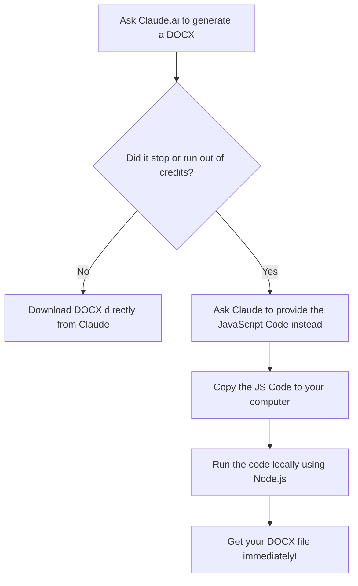

# Local DOCX Generation Guide (Claude.ai Workaround)

## 🎯 The Use Case: Why do we need this?

**The Scenario:** 
Imagine you are using Claude.ai to generate a complex or lengthy Word document (.docx). Sometimes, due to generation limits or running low on usage credits, Claude might stop generating the actual `.docx` file for you to download. 

**The Trick:**
Instead of waiting for your credits to reset, you can use a clever workaround. Claude can very quickly give you the **JavaScript code** (using the `docx` package) needed to build that exact document. You can simply copy this code, run it locally on your own computer, and generate the document yourself! 

This guide shows you exactly how to take that code and turn it into your final `.docx` file, **even if you have zero programming experience.**

---

## 🗺️ Process Flow

Here is a visual breakdown of how this workaround operates:



---

## ⚙️ Step-by-Step Instructions

### 0. Prerequisites: Install Node.js (First Time Only)

If you have never run code on your computer before, you need to install a free program called **Node.js**. This program acts as the "engine" that allows your computer to understand and run JavaScript code.

1. Go to the official Node.js website: [https://nodejs.org/](https://nodejs.org/)
2. Download the version labeled **"LTS" (Long Term Support)**. This is the most stable and recommended version.
3. Open the downloaded file and run the installer. You can just click "Next" through all the default options. 
4. Once installed, your computer is fully equipped to run JavaScript!

---

### 1. Setup your Environment

1. Download and install a free code editor, like **Visual Studio Code (VS Code)**, from [https://code.visualstudio.com/](https://code.visualstudio.com/).
2. Create a new folder on your computer (for example, on your Desktop) and name it something like `Document-Generator`.
3. Open **Visual Studio Code**, go to the top menu, click **File > Open Folder**, and select the folder you just created.
4. Open the built-in terminal in VS Code by going to the top menu and clicking **Terminal > New Terminal**.
5. In that terminal window at the bottom of your screen, type the following commands (press **Enter** after each one) to download the tool that builds the document:

```bash
npm init -y
npm install docx
```

### 2. Create the Script File

1. In the VS Code file explorer (on the left side), click the "New File" icon and name the file exactly `index.js`.
2. Paste the JavaScript code that Claude provided you into this `index.js` file and save it (`Ctrl+S` on Windows, or `Cmd+S` on Mac).

### 3. Fix the Output File Path

Before running the code, you must ensure the code knows exactly where to save the file on your local machine.

- Look near the very bottom of the code you pasted. You will see a line that looks something like `fs.writeFileSync(...)`.
- **Make a Decision:** Claude might write a file path meant for its own internal servers (e.g., `fs.writeFileSync("/mnt/user-data/outputs/document.docx", buf);`). 
- You must manually change that path to just the file name so it saves directly in your current folder.
- **Change it to look like this:**
  ```javascript
  fs.writeFileSync("My_Document.docx", buf);
  ```

### 4. Execute the Code

Now it is time to generate the document! In the same terminal window at the bottom of VS Code, type this command and press Enter:

```bash
node index.js
```

### 5. View your Document

If everything worked correctly, a new `.docx` file will instantly appear in your folder in VS Code! 

You can now navigate to that folder on your computer and double-click the document to open it in Microsoft Word or any compatible application.
